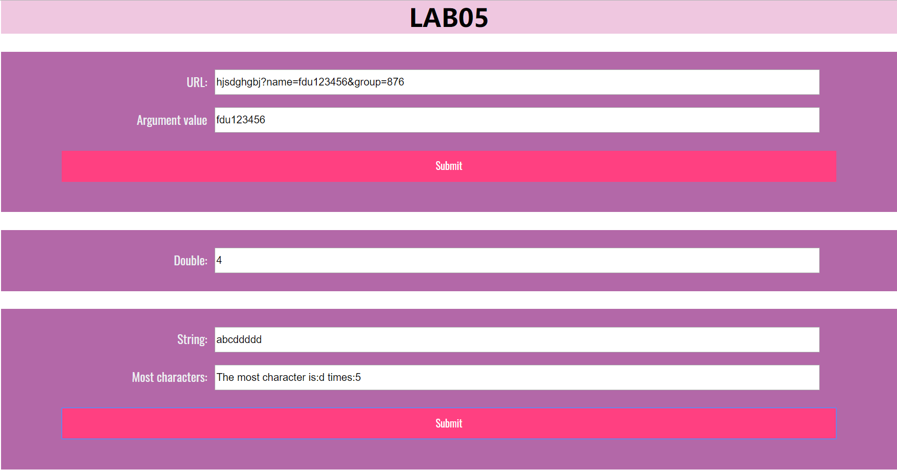
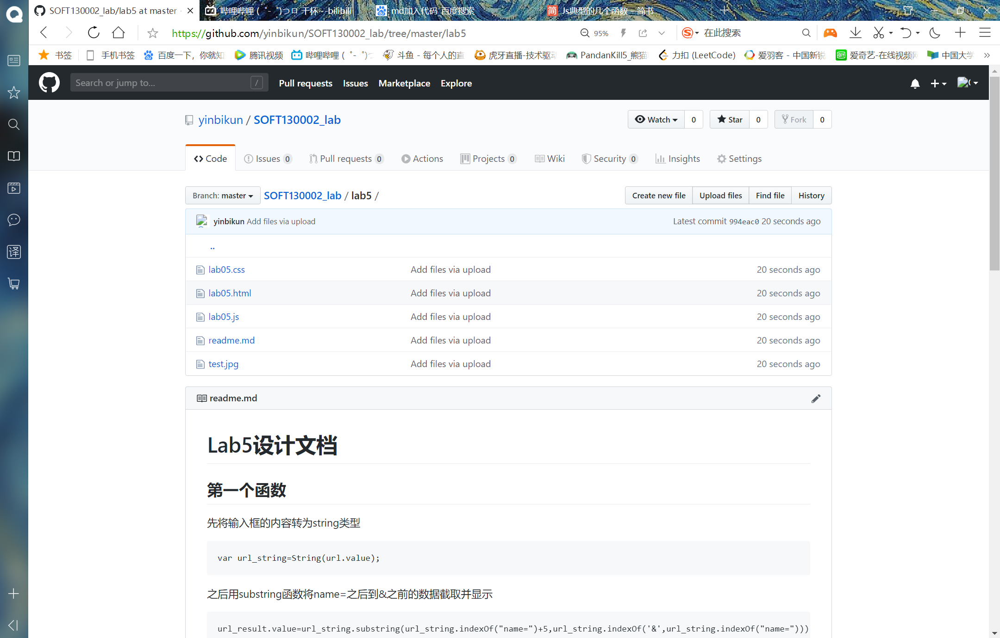

# Lab5设计文档

## 第一个函数

先将输入框的内容转为string类型

```
var url_string=String(url.value);
```

之后用substring函数将name=之后到&之前的数据截取并显示

```
url_result.value=url_string.substring(url_string.indexOf("name=")+5,url_string.indexOf('&',url_string.indexOf("name=")));
```


## 第二个函数

先在网页打开时获得一个时间start，
之后运用时间运行函数intervalId每隔5000ms运行一次timeTest,
在intervalId中获得一个当前时间now，
当now.getMinutes()!==start.getMinutes()即已经运行到了下一个分钟时停止运行，
或在++i>10即运行十次后停止

```
const start =new Date();
   var intervalId=setInterval(function(){
       let i=0;
       let now=new Date();
       if(now.getMinutes()!==start.getMinutes()||++i>10){
           clearInterval(intervalId);
       }
       timeTest();
   },5000);
```

timeTest函数内先获取输入框的输入值，
如果没有输入值就将输入框的值改为"1",
之后每次在外层运行时将输入框内的值*2

```
function timeTest(){
    let number=mul.value;
    if(number==0)
        mul.value="1";
    else
        mul.value=String(number*2);
}
```

## 第三个函数

遍历most_str其中的每一个字符将其某个字符的值及出现的次数拿出来作为json的元素，
判断json中是否有当前str的值，
如果不存在，就将当前值添加到json中去，
存在的话就让数组中已有的当前值的index值+1

```
var most_str=String(most.value);
    var json=[];
    for (var i = 0; i < most_str.length; i++) {
        if (!json[most_str.charAt(i)]) {
            json[most_str.charAt(i)] = 1;
        } else {
            json[most_str.charAt(i)]++;
        }
    }
```

存储出现次数最多的值number和次数num，
遍历json如果当前项大于下一项，
就让当前值更改为出现最多次数的值，
最后将相应的结果打印出来

```
 var number;
    var num=0;
    for (var i in json)
        if (json[i]>num) {
            num = json[i];
            number = i;
        }
    result.value="The most character is:" + number + " times:" + num;
```

## 截图

###  网页示例截图



### GitHub页面截图

