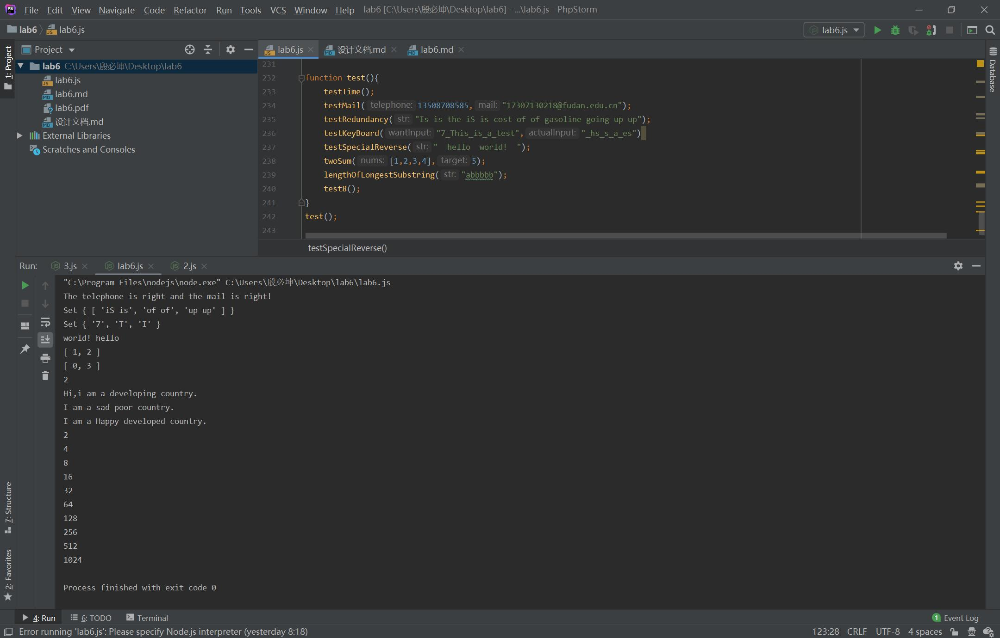

# Lab6设计文档

## 正则表达式

###电话号码

正则表达式为/^1\d{10}$/

使用^和&匹配电话号码，确保前后没有相应字符数据，以1开头且后面\d{10}表示在开头的1之后跟着十个数字

###邮箱

正则表达式为/^[a-zA-Z0-9_\-.]+@[a-zA-Z0-9_-]+((\.[a-zA-Z0-9_-]+){2,4})$/

使用^和&作为开头和结尾，确保前后没有其他字符数据，@前为数字大小写字母_\-.的任意组合，@后为邮箱域名，
"."之前为数字大小写字母_\-.的任意组合，之后为长为2-4个字符的结尾如com、cn等等

###重复单词

正则表达式为/\b([a-z]+) \1\b/ig

前后的\b用来限制匹配单词的边界，[a-z]+表示匹配小写字母1次或多次，\1表示再匹配一次前面括号中的内容，ig表示匹配时不区分大小写

## 对继承不同方式的理解

###原型链继承

其特性有：为子类添加子类特有方法要在原型替换语句后，可以在子类原型中覆盖父类方法，
父类中的实例属性会成为子类的原型属性，无法在不影响所有子类实例情况下向父类构造函数传参

###借用构造函数继承

借用构造函数继承也称为伪造对象或经典继承，基本思想是在子类构造函数内部调用父类构造函数

特性有：本质是在子类实例中创建了父类属性，应在子类构造函数一开始调用父类构造函数，
必须使用call的调用方式，否则容易造成无限循环

缺陷：父类实例方法无法被复用，父类原型中的属性和方法对子类不可见而无法同时使用构造和原型

###组合继承

组合继承也称为伪经典继承，基本思想是用原型链实现对原型属性和方法继承，又同时通过借用构造函数实现对实例属性继承

它避免了原型链和构造函数的缺点，融合了两者的优点，但是任何情况下都要调用两次父类构造函数

## Map、Set、Array之间的区别和使用

Array最简单的数组具有一个下标对应一个元素的结构

Map是键值对的结构，具有极快的查找速度，例如hashmap等数据结构类型，所以在6、7两题，均是用map存储相应的键值信息，这样查找时可以根据键值对的匹配关系进行更快的查找而不用多重循环。

Set和Map类似，但set只存储key，且key不重复

##页面截图

